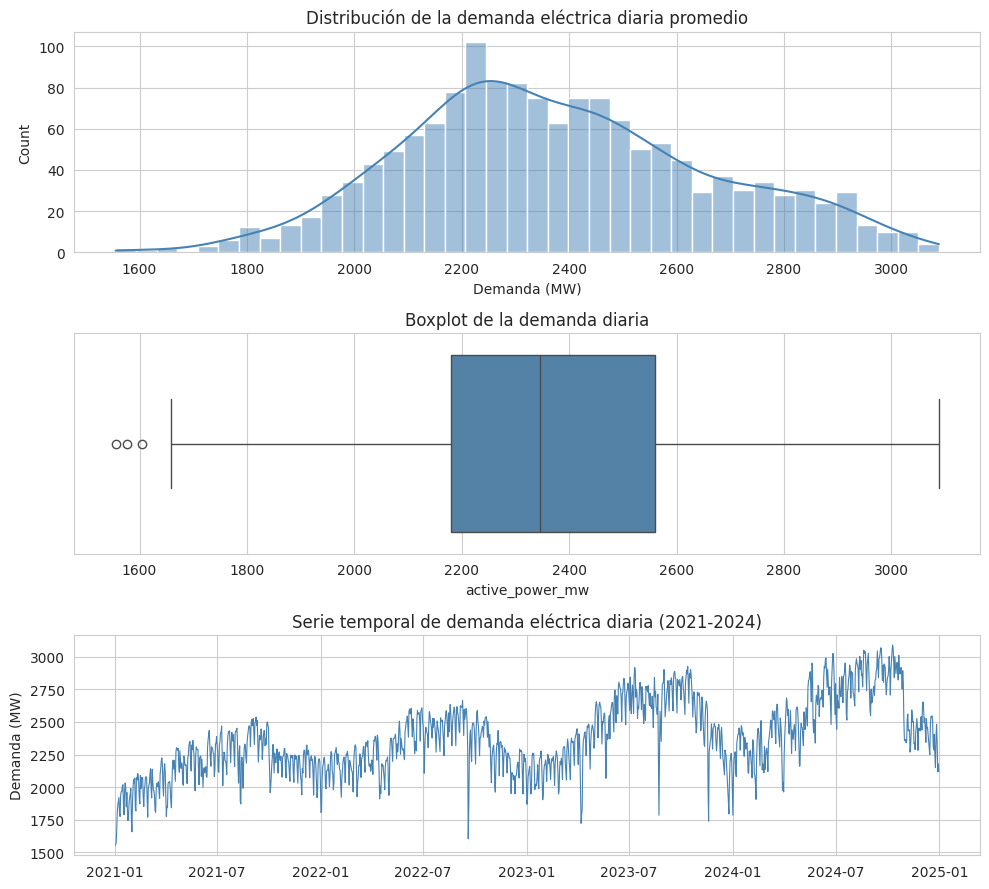
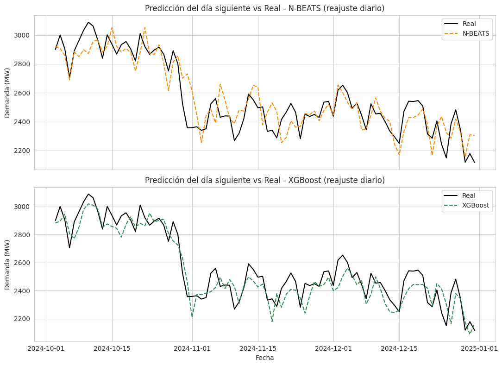
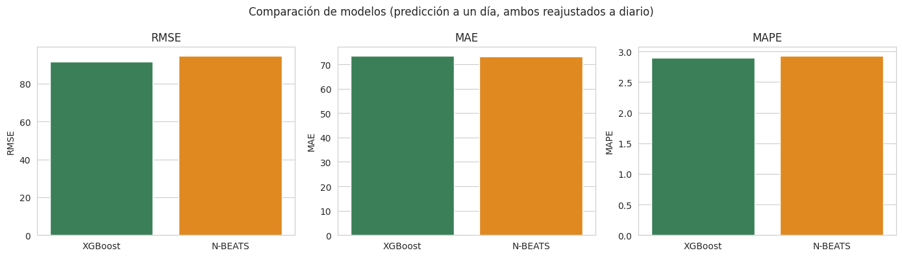
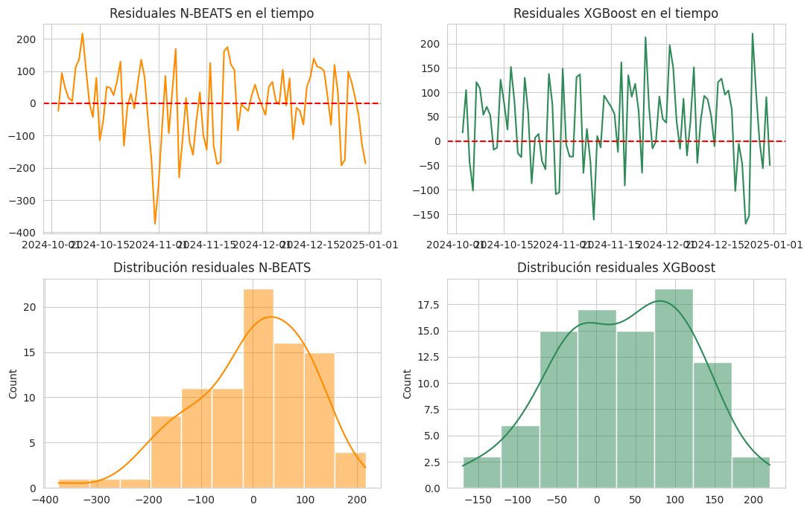
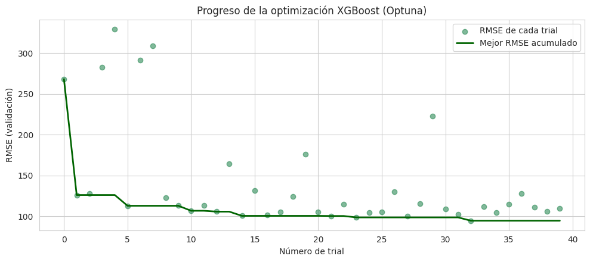
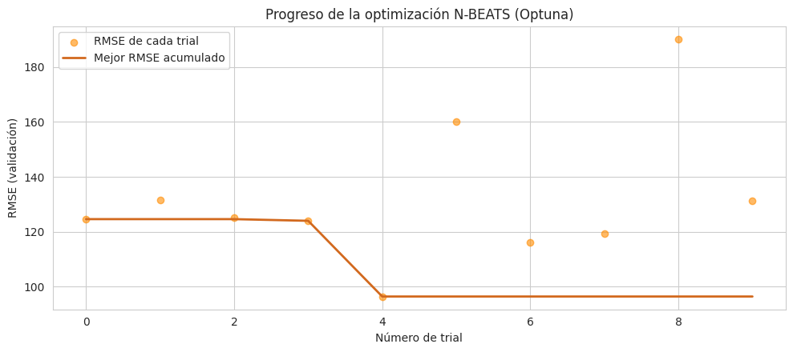
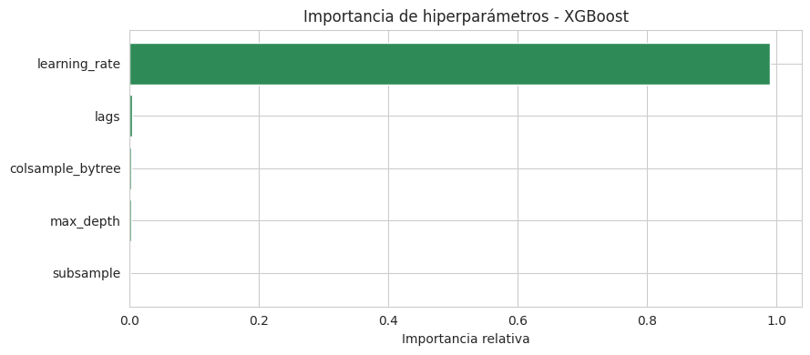
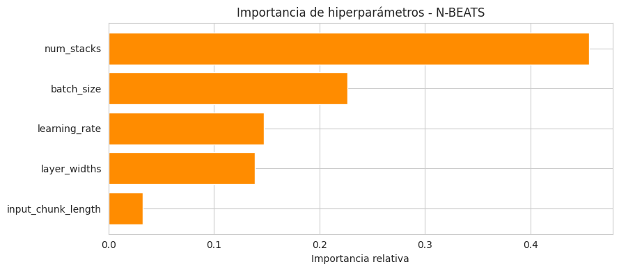
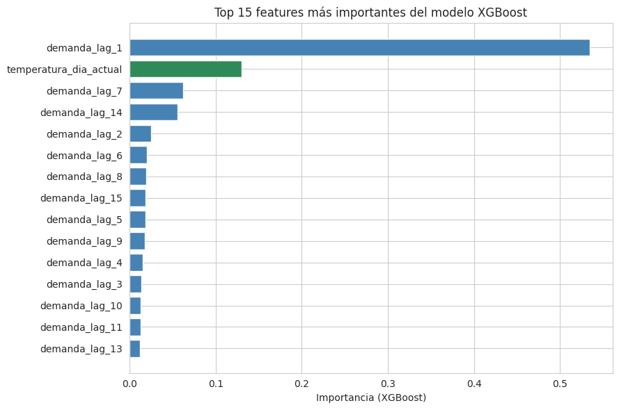
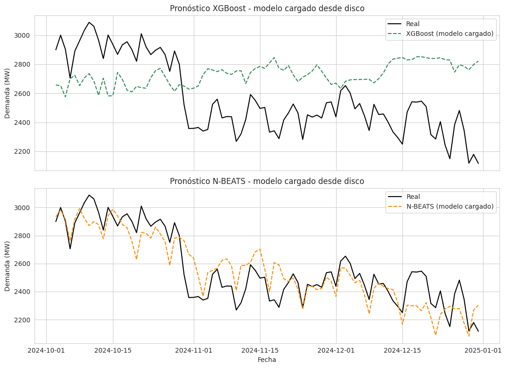

# Pronóstico de Demanda Eléctrica — SENI (República Dominicana)
### Predicción a un día con reajuste diario (walk-forward retrain)

Proyecto de forecasting de series temporales que implementa el flujo de trabajo completo:
preprocesamiento, modelado, evaluación y presentación de resultados, sobre la demanda eléctrica
del Sistema Eléctrico Nacional Interconectado (SENI) de República Dominicana, agregada a
resolución diaria.

## Descripción del problema

La operación segura y económica de un sistema eléctrico depende de anticipar con precisión la
demanda futura de energía. Este proyecto se enfoca en el pronóstico **a un día** (t+1), con
**reajuste diario** del modelo — una metodología que refleja cómo operaría un sistema de
pronóstico en producción: cada día se reentrena con los datos reales más recientes antes de
predecir el día siguiente, evitando que el modelo opere con pesos "congelados" que se degradan
con el tiempo (*concept drift*).

**Objetivo:** construir y comparar dos modelos de categorías distintas —Machine Learning
(XGBoost) y Deep Learning (N-BEATS)— bajo una metodología de evaluación idéntica y justa:
predicción a un día, walk-forward, con reajuste diario y optimización automática de
hiperparámetros (Optuna).

## Dataset utilizado

**Fuente:** Uceta-Acosta, R.O. et al. (2025). *A dataset of exogenous variables and historical
electricity demand for short-term load forecasting of the national interconnected electric
system (SENI) in the Dominican Republic from 2021 to 2024.* Data in Brief, 63, 112057.
[Kaggle](https://www.kaggle.com/datasets/rafaeluceta/short-term-forecasting-dataset-seni-dominican-rep) ·
Licencia CC BY-NC-SA 4.0.

- Fuente original: 35,039 horas (enero 2021 - diciembre 2024), agregadas a **promedio diario**
  → 1,460 días, sin valores faltantes.
- Variable objetivo: `active_power_mw` (demanda diaria promedio, en MW).
- Variables retenidas: `apparent_temperature_c`, `cloud_cover_percent`, `is_holiday`,
  `is_weekend`, `is_school_vacation`. (Los 24 lags horarios del dataset original se descartan;
  cada modelo reconstruye su propia estructura de lags a nivel diario según corresponda.)

## Metodología aplicada

1. Carga y validación de datos, agregación de resolución horaria a diaria (promedio).
2. Análisis exploratorio (EDA): distribución, tendencia, correlación a nivel diario.
3. División temporal en **tres** conjuntos (no aleatoria):
   - `train_opt` (1,280 días): entrenamiento de pesos.
   - `val_opt` (90 días): early stopping y evaluación de cada trial de Optuna. Nunca se usa
     para actualizar pesos del modelo.
   - `test` (90 días finales, oct-dic 2024): aislado, usado una única vez para la evaluación final.
4. Optimización de hiperparámetros con Optuna (búsqueda automática) + early stopping en ambos
   modelos, usando `val_opt` como criterio.
5. Evaluación con **walk-forward validation y reajuste diario** (`retrain=True`): para cada uno
   de los 90 días de test, el modelo se reentrena con todos los datos reales disponibles hasta
   el día anterior y predice únicamente el día siguiente (horizonte = 1 día). Se repite día a día.
6. Métricas y comparación visual + análisis de residuales.

## Modelos implementados

| Modelo  | Categoría | Covariates usadas | Optimización |
|---------|------------|---|---|
| **XGBoost** | Machine Learning | `future_covariates`: temperatura del día a predecir | Optuna (40 trials): lags, max_depth, learning_rate, subsample, colsample_bytree. Early stopping (tope `n_estimators=50`). |
| **N-BEATS** | Deep Learning | `past_covariates`: temperatura, nubosidad, feriado, fin de semana, vacaciones escolares | Optuna (10 trials): input_chunk_length, num_stacks, layer_widths, learning_rate, batch_size. Early stopping (patience=8, tope 50 épocas). |
Ambos con `output_chunk_length` / `forecast_horizon = 1` (predicción a un solo día), y ambos
reentrenados diariamente durante la evaluación (`retrain=True`)condición pareja para que la comparación sea justa.

## Resultados y métricas

Métricas calculadas sobre el conjunto de prueba (90 días, oct-dic 2024), con reajuste diario:

| Modelo | RMSE (MW) | MAE (MW) | MAPE (%) | sMAPE (%) | R² |
|---|---|---|---|---|---|
| **XGBoost** | 92.42 | 76.84 | 3.03 | 3.06 | 0.867 |
| N-BEATS | 109.98 | 87.31 | 3.49 | 3.46 | 0.812 |

XGBoost obtuvo el mejor desempeño en las cinco métricas.

## Visualizaciones

**01 · Preprocesamiento — EDA de la demanda diaria**



La distribución es ligeramente asimétrica hacia la derecha, centrada alrededor de 2300-2400 MW
(rango ~1500-3100 MW). La serie temporal —ya sin el ruido del ciclo horario, al ser promedio
diario— muestra con claridad la tendencia creciente 2021-2024 y la estacionalidad anual (picos
hacia mitad de año). El boxplot marca 3 outliers bajos (~1550-1650 MW), consistentes con eventos
atípicos ya identificados en el dataset original (feriados, incidentes del sistema).

**03 · Evaluación — Predicción del día siguiente vs. real (reajuste diario)**



Ambos modelos siguen de cerca la trayectoria real durante todo el período de prueba, incluyendo
la caída abrupta de demanda a fines de octubre (~2900 → ~2350 MW). XGBoost (verde) sigue la
curva real de forma casi superpuesta la mayor parte del tiempo; N-BEATS (naranja) también la
sigue de cerca pero con oscilaciones algo más amplias.

**03 · Evaluación — Comparación de métricas**



XGBoost por debajo de N-BEATS en las tres métricas, consistente con la tabla de resultados.

**03 · Evaluación — Análisis de residuales**




**04 · Visualizaciones — Progreso de Optuna**





**04 · Visualizaciones — Importancia de hiperparámetros**





**04 · Visualizaciones — Importancia de features (XGBoost)**



**04 · Visualizaciones — Pronóstico sin reajuste diario (contraste metodológico)**



> **Nota metodológica importante:** este gráfico reproduce el pronóstico de cada modelo cargado
> desde disco usando `modelo.predict(n=90, ...)` — un solo pronóstico de 90 días seguidos, **sin**
> reentrenar en el camino. Muestra un desvío sistemático mucho mayor (XGBoost se mantiene
> ~300-400 MW por encima de la realidad durante buena parte del período) que el observado en la
> evaluación oficial del proyecto (con reajuste diario). **No es una inconsistencia**: son dos
> metodologías distintas aplicadas al mismo modelo entrenado, y es la evidencia más clara del
> proyecto sobre por qué el reajuste diario importa (*concept drift*). Se incluye como
> comparación ilustrativa, no como resultado principal.

## Conclusiones

- **XGBoost superó a N-BEATS** en las cinco métricas, con margen consistente (RMSE ~16% menor,
  MAPE ~0.5 puntos porcentuales menor). Bajo la misma metodología de evaluación, el modelo más
  simple volvió a ganarle al más complejo.
- El **R² de ambos modelos (0.867 y 0.812) es sustancialmente más alto** que en un pronóstico
  recursivo de horizonte largo: el horizonte corto (1 día) con reajuste diario contra datos
  reales evita la acumulación de error que sí se observa en pronósticos multi-paso sin reajuste.
- Un **MAPE de ~3%** en la demanda diaria promedio es un resultado sólido para forecasting de
  energía a un día.
- El costo de este desempeño es **computacional**: cada uno de los 90 días de test implicó
  reentrenar ambos modelos desde cero. XGBoost lo resuelve en segundos por reentrenamiento;
  N-BEATS necesitó un presupuesto fijo de épocas (sin early stopping) para que el walk-forward
  completo fuera viable en tiempo razonable.
- La comparación entre el gráfico "predicción vs. real" (reajuste diario) y el gráfico "modelo
  cargado desde disco" (sin reajuste) es la evidencia más elocuente del proyecto: el mismo
  modelo XGBoost pasa de seguir la curva real casi perfectamente (MAPE ~3%) a mantenerse
  sistemáticamente ~300-400 MW por encima de la realidad durante semanas — una demostración
  directa y cuantificada de *concept drift*.

## Estructura del repositorio

```
seni_forecasting_v2/
├── README.md
├── requirements.txt
├── imagenes/                     (capturas exportadas de cada notebook)
├── data/
│   └── datos_modelo.csv          (dataset original horario)
├── 01_preprocesamiento.ipynb     (genera datos_diarios.csv, train.csv, train_opt.csv,
│                                   val_opt.csv, test.csv)
├── 02_modelos.ipynb              (genera xgb_best_model.pkl, nbeats_best_model.pkl,
│                                   *_best_params.json, optuna_*.db, optuna_trials_*.csv)
├── 03_evaluacion.ipynb           (genera predicciones.csv, metricas.csv)
└── 04_visualizaciones.ipynb      (carga los modelos guardados, no reentrena)
```

## Cómo ejecutar

```bash
pip install -r requirements.txt
jupyter notebook 01_preprocesamiento.ipynb
```

**Importante:** correr los 4 notebooks **en orden** (01 → 02 → 03 → 04), ya que cada uno
depende de archivos generados por el anterior (CSVs, modelos guardados, hiperparámetros, bases
Optuna). El notebook 02 es el más lento (Optuna prueba 40 + 10 combinaciones de hiperparámetros,
entrenando un modelo por cada una).

## Referencia del dataset

Uceta-Acosta, R.O., Mariano-Hernandez, D., Rivas-Peña, Y., Ocaña-Guevara, V.S., Aybar-Mejía, M.,
Domínguez-Garabitos, M.A. (2025). *A dataset of exogenous variables and historical electricity
demand for short-term load forecasting of the national interconnected electric system (SENI) in
the Dominican Republic from 2021 to 2024.* Data in Brief, 63, 112057.
https://doi.org/10.1016/j.dib.2025.112057
